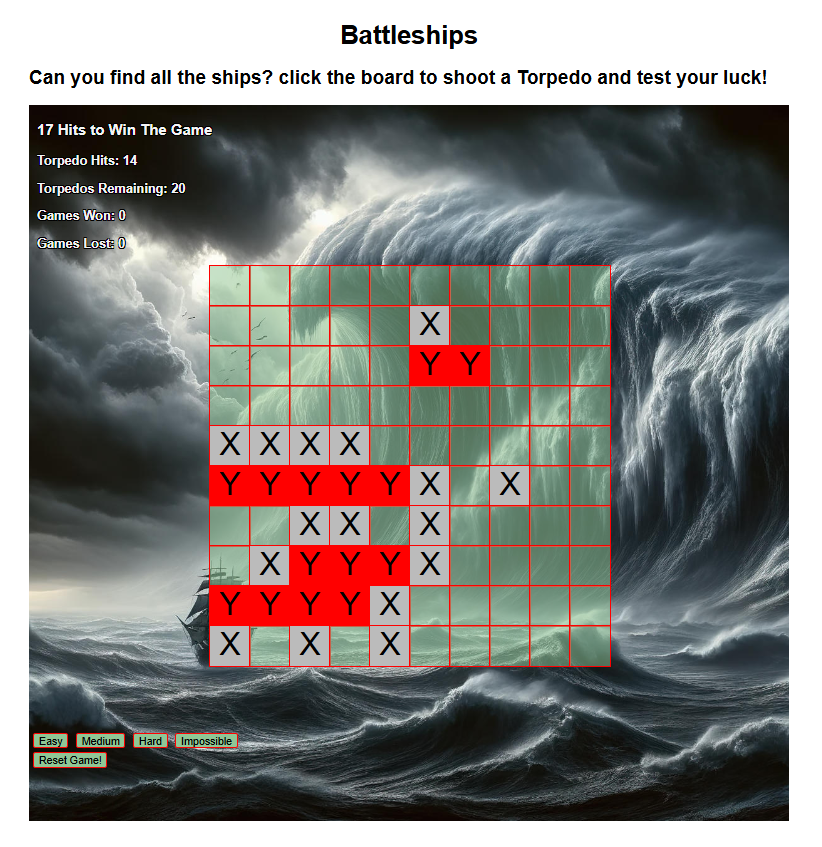
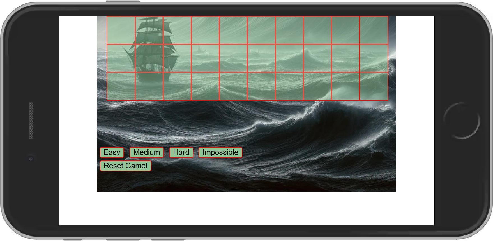
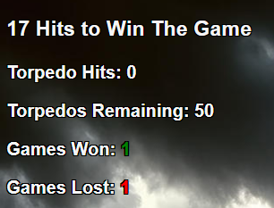
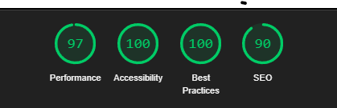

Welcome to Battleships Mini

# Battleships Mini game.

**October 25th, 2024**

 
 
  

## Description

This website allows an interactive Battleship mini game to be played on different difficulties with a score of games won and games lost, along with a reset ability to 
reset the game to the start to try again without refreshing the page.

the features within this website include;

- Landing page

  - `Description` - Description shows the game name, the requirement to win the game.

  

  - `Torpedos Hit Counter` - Shows how many torpedos have actually hit the 'target' / 'Ship' and when the number matches the win requirement it sends an alert to the user letting them know theyve won.

  

  - `Torpedos Left Counter` - Shows the amount of torpedos you have left to fire depending on the difficulty of the game selected e.g. easy mode = 50, medium mode = 40, hard mode = 30 and impossible mode = 20. Once all torpedos have been fired the game ends, sending an alert to the user letting them know the game is over.

  

  - `Games Won Counter` - When you have reached the win requirement this counter increases by 1 and changes from black text to green to represent this visually back to the user.

  

  - `Games Lost Counter` - when all the torpedos have been fired and the number decreases to 0 indicating game over, this counter increases by 1 and changes text from black to red to represent this visually back to the user.

  

  - `GameBoard` - An interactive 10x10 grid where the battleships will be placed randomly with each game start, game reset or difficulty chosen, each grid square will change colour and present a different letter to display whether its a hit or a miss e.g. a hit on a battleship will show up red with an 'Y' and a miss will show up grey with an 'X', if you attempt to click the same square that has already been clicked, you will get a pop up alert to display you've clicked an existing square.

  

  - `Game Alerts` - Game alerts will present on certain completed actions e.g. Winning the game, Losing the game or clicking an already intereacted with square

  ##### Winning Game Message
  

  ##### Losing Game Message
  

  ##### Click already intereacted with square
  

  - `Game Difficulty Buttons` - There are 4 difficulty options to choose from displayed as buttons under the gameboard, when selecting a certain difficulty the amount of
  torpedos left to use will be set to a certain limit i.e. easy = 50, medium = 40, hard = 30 and impossible = 20. whenever a game difficulty button is clicked it will also reset
  the gameboard and gameinfo apart from games won and games lost (this will remain updating until the webpage is refreshed.)

  

  - `Reset Game Button` - This button resets the game board and the game difficulty back to easy.

  

  ## Planned updates / Challenges

  - Planned changes
    - Fix known issues and bugs
    - Create draggble representations of the ships available and allow rotation to be manually placed within the gameboard.
    - Add icons / images along with sound effects to the hits and misses for a better UI instead of 'X' and 'Y'
    - Create a better way to play this game on mobile devices under 721px without requiring landscape mode.

- Challenges
  - When playing the game and pressing the easy button, it doesnt reset the game like the other buttons due as it creates a loop within the function, so i needed to add to the 
  select difficulty function that when the easy button is pressed, the reset game button is also clicked within javascript.
  - Creating a way to have this game fully responsive, however due to the size of the gameboard that needs to be interacted with, if it was full reponsive eventually the gameboard would be too small to click. (currently needs to be played in landscape mode if under 721px width)
  - 
  - 

## Testing

- 
- 
- 
- 

## Validator Testing

- HTML Validator
  - No issues found
- CSS3 Validator
  - 1 issue present due to using external stylesheet i.e Google Fonts

#### Game Page Lighthouse

##### Lighthouse Desktop

##### Lighthouse Mobile

## Bugs / Issues

- Current bugs / issues
  - Issue on devices smaller than 721px due to the gameboard needing to be a certain size 10x10 it was really possible to shrink the board in a way to work in portrit mode on 
  devices under 721px (these devices need to run the game while in landscape.)
  - Issue when Winning the game, the game resets to easy mode but sets the torpedos left to '49' instead of '50', it resets correctly when resetting the game or when losing the game.

## Usage

Within GitPod please open up a bash shell and type the below

`python3 -m http.server`

A blue button should appear to click: _Make Public_,

Another blue button should appear to click: _Open Browser_.

To run a backend Python file, type `python3 app.py` if your Python file is named `app.py`, of course.

A blue button should appear to click: _Make Public_,

Another blue button should appear to click: _Open Browser_.

## Running the Game

1. Browse to GitHub page - https://github.com/ItsJustJim33Code/BattleShips-Mini

2. Select deployments 

3. Click the link at the top which will be the latest deployed version - https://itsjustjim33code.github.io/BattleShips-Mini/

4. Select your dificulty and test your luck by selecting squares on the game board.

##### Ship information

- Aircraft Carrier - 5 hits
- Battleship       - 4 hits
- Destroyer        - 3 hits
- Submarine        - 3 hits
- Frigate          - 2 hits

## References

- `FireTorpedo Function` - source code from http://www.kirupa.com/html5/handling_events_for_many_elements.htm: + https://github.com/LearnTeachCode/Battleship-JavaScript 
- `Create Gameboard Function` - ChatGPT using the following questions ("how can i make sure that this code belows first removes all the divs it creates and then rebuilds the divs after" + "how can i randomise this array while making sure that i have 1s in a row of certain lengths" + "static gameboard above + can i define the sizes of the groups of 1s in a variable and assign those to the board and then fill with 0s?")
- `Create the grid squares within the div via javascript` - https://github.com/LearnTeachCode/Battleship-JavaScript
- `Increment and Decrement scores and various other code` - Love Maths Walkthrough project via Code Institute
- `Text Shadow` - https://kinsta.com/blog/css-text-outline
- 
- 

## Contact

  - `Email:` jamestaylor21@btinternet.com
  - `Linkedin:` https://www.linkedin.com/in/james-taylor-33686b66/
  - `GitHub:` https://github.com/ItsJustJim33Code

## Release History

We continually tweak and adjust this template to help give you the best experience. Here is the version history:

**October 22, 2024,** - Website released v1.0

